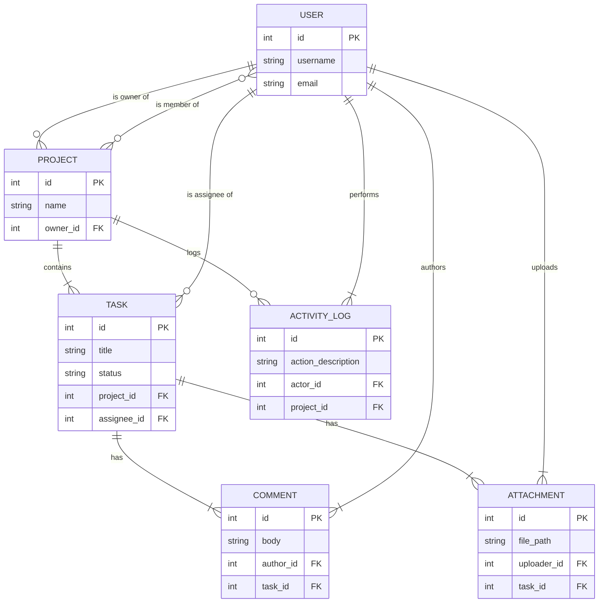

# Task Management System API (Hệ thống Quản lý Công việc)

Một RESTful API mạnh mẽ, được xây dựng bằng Django và Django REST Framework, mô phỏng các chức năng cốt lõi của các công cụ quản lý dự án chuyên nghiệp như Trello, Asana, hay Jira.

Dự án này không chỉ cung cấp các chức năng CRUD cơ bản mà còn tích hợp hệ thống phân quyền chi tiết, theo dõi lịch sử hoạt động và một cấu trúc API có khả năng mở rộng cao, phù hợp cho các ứng dụng làm việc nhóm trong thực tế.

## Mục lục
1.  [Các Tính năng Chính](#1-các-tính-năng-chính)
2.  [Công nghệ sử dụng](#2-công-nghệ-sử-dụng)
3.  [Thiết kế Hệ thống & ERD](#3-thiết-kế-hệ-thống--sơ-đồ-quan-hệ-thực-thể-erd)
4.  [Tài liệu API (API Documentation)](#4-tài-liệu-api-api-documentation)
5.  [Hướng dẫn Cài đặt](#5-hướng-dẫn-cài-đặt-và-chạy-dự-án)
6.  [Triển khai (Deployment)](#6-triển-khai-deployment)
7.  [Tính năng Nâng cao & Hướng Phát triển](#7-tính-năng-nâng-cao--hướng-phát-triển)

---

## 1. Các Tính năng Chính
*   ✅ **Xác thực Người dùng:** Đăng ký, đăng nhập an toàn sử dụng JSON Web Tokens (JWT).
*   ✅ **Quản lý Dự án:** Tạo dự án, thêm/xóa thành viên, phân quyền `owner` và `member`.
*   ✅ **Quản lý Công việc:** Tạo, giao việc, cập nhật trạng thái (`To-Do`, `In Progress`, `Done`) và độ ưu tiên.
*   ✅ **Tương tác & Hợp tác:** Thêm bình luận và đính kèm tập tin vào từng công việc.
*   ✅ **Theo dõi Lịch sử:** Tự động ghi lại nhật ký của tất cả các hoạt động quan trọng trong một dự án.
*   ✅ **Phân quyền Chi tiết:** Hệ thống phân quyền mạnh mẽ đảm bảo người dùng chỉ có thể truy cập dữ liệu họ được phép.
*   ✅ **Tìm kiếm & Lọc:** API hỗ trợ lọc và tìm kiếm dữ liệu theo nhiều tiêu chí.

---

## 2. Công nghệ sử dụng
*   **Backend:** Python, Django, Django REST Framework
*   **Database:** SQLite 3 (phát triển), PostgreSQL (sản phẩm)
*   **Xác thực:** djangorestframework-simplejwt (JWT)
*   **Lọc & Tìm kiếm:** django-filter
*   **Tài liệu API:** drf-spectacular (Swagger/OpenAPI)
*   **Xử lý file:** Pillow

---

## 3. Thiết kế Hệ thống & Sơ đồ Quan hệ Thực thể (ERD)

### 📊 Sơ đồ ERD (Entity Relationship Diagram)



### ✅ Mapping sang Django Model

| Thực thể (Entity) | Django Model | Mối quan hệ chính (Key Relationships) |
| :--- | :--- | :--- |
| Người dùng | `User` | Kế thừa `AbstractUser` |
| Dự án | `Project` | `owner = ForeignKey(User)`, `members = ManyToManyField(User)` |
| Công việc | `Task` | `project = ForeignKey(Project)`, `assignee = ForeignKey(User)` |
| Bình luận | `Comment` | `task = ForeignKey(Task)`, `author = ForeignKey(User)` |
| Tệp đính kèm | `Attachment` | `task = ForeignKey(Task)`, `uploader = ForeignKey(User)` |
| Nhật ký | `ActivityLog` | `project = ForeignKey(Project)`, `actor = ForeignKey(User)` |

---

## 4. Tài liệu API (API Documentation)

Dự án tích hợp `drf-spectacular` để tự động tạo tài liệu API theo chuẩn OpenAPI 3.0.

### Hướng dẫn truy cập
1.  Chạy server phát triển (`python manage.py runserver`).
2.  Mở trình duyệt và truy cập vào địa chỉ: **`http://127.0.0.1:8000/api/docs/`**

Tại đây, bạn có thể xem danh sách tất cả các API endpoint, chi tiết về các tham số, body request, response mẫu và thử nghiệm trực tiếp các API.

### ✅ Demo API endpoints (Danh sách chi tiết)

<details>
<summary><strong>Nhấn để xem danh sách các Endpoints</strong></summary>

**Base URL**: `/api/`
**Authentication**: Tất cả các endpoint (trừ `/signup/`, `/login/`) đều yêu cầu `Authorization: Bearer <access_token>` trong header.

#### 1. Authentication
*   **`POST /signup/`**: Đăng ký tài khoản mới.
*   **`POST /login/`**: Đăng nhập, nhận về `access` và `refresh` token.

#### 2. Projects
*   **`GET /projects/`**: Lấy danh sách các dự án mà bạn là thành viên.
*   **`POST /projects/`**: Tạo một dự án mới.
*   **`GET /projects/{id}/`**: Lấy chi tiết một dự án.
*   **`PUT /projects/{id}/`**: Cập nhật dự án.
*   **`PATCH /projects/{id}/`**: Cập nhật một phần dự án.
*   **`DELETE /projects/{id}/`**: Xóa một dự án.
*   **`POST /projects/{id}/add_member/`**: Thêm thành viên vào dự án.
*   **`POST /projects/{id}/remove_member/`**: Xóa thành viên khỏi dự án.

#### 3. Tasks
*   **`GET /projects/{project_pk}/tasks/`**: Lấy danh sách công việc của một dự án (hỗ trợ lọc).
*   **`POST /projects/{project_pk}/tasks/`**: Tạo công việc mới trong dự án.
*   **`GET /tasks/{id}/`**: Lấy chi tiết một công việc.
*   **`PUT /tasks/{id}/`**: Cập nhật công việc.
*   **`PATCH /tasks/{id}/`**: Cập nhật một phần công việc.
*   **`DELETE /tasks/{id}/`**: Xóa công việc.

#### 4. Comments & Attachments
*   **`GET /tasks/{task_pk}/comments/`**: Lấy danh sách bình luận của một công việc.
*   **`POST /tasks/{task_pk}/comments/`**: Thêm bình luận mới.
*   **`PUT /tasks/{task_pk}/comments/`**: Cập nhật bình luận.
*   **`PATCH /tasks/{task_pk}/comments/`**: Cập nhật một phần bình luận.
*   **`DELETE /comments/{id}/`**: Xóa bình luận.
*   **`POST /tasks/{task_pk}/attachments/`**: Tải lên một tệp đính kèm mới.
*   **`DELETE /attachments/{id}/`**: Xóa một tệp đính kèm.

#### 5. Activity Log
*   **`GET /projects/{project_pk}/activities/`**: Lấy lịch sử hoạt động của một dự án.
*   **`GET /projects/{project_pk}/tasks/activities/`**: Lấy lịch sử hoạt động của một task của dự án.

</details>

---

## 5. Hướng dẫn Cài đặt và Chạy dự án

Để chạy dự án này trên máy của bạn, hãy làm theo các bước sau:

**1. Yêu cầu:**
*   Python 3.8+
*   PIP

**2. Clone repository:**
```bash
git clone https://github.com/TrungCG/TaskManagementSystem.git
cd TaskManagementSystem
```

**3. Tạo và kích hoạt môi trường ảo (Virtual Environment):**
*   Trên macOS/Linux:
    ```bash
    python3 -m venv venv
    source venv/bin/activate
    ```
*   Trên Windows:
    ```bash
    python -m venv venv
    .\venv\Scripts\activate
    ```

**4. Cài đặt các thư viện cần thiết:**
```bash
pip install -r requirements.txt
```
*(Nếu chưa có file `requirements.txt`, hãy tạo với nội dung: `django`, `djangorestframework`, `djangorestframework-simplejwt`, `Pillow`, `django-filter`, `drf-spectacular`)*

**5. Cấu hình Database:**
Chạy lệnh migrate để tạo các bảng trong database (mặc định là SQLite).
```bash
python manage.py makemigrations
python manage.py migrate
```

**6. Tạo Superuser:**
Tạo một tài khoản admin để truy cập vào trang quản trị của Django.
```bash
python manage.py createsuperuser
```

**7. Chạy Development Server:**
```bash
python manage.py runserver
```
API server sẽ chạy tại địa chỉ `http://127.0.0.1:8000/`.

---

## 6. Triển khai (Deployment)

Mô hình triển khai đề xuất cho một ứng dụng Django chuyên nghiệp:

**Client --> Nginx --> Gunicorn --> Django App**

### Checklist Triển khai
1.  **Database:** Chuyển sang sử dụng một hệ quản trị CSDL mạnh mẽ hơn như **PostgreSQL** cho môi trường production.
2.  **WSGI Server:** Sử dụng **Gunicorn** để chạy ứng dụng Django, thay thế cho server phát triển `runserver`.
3.  **Web Server/Reverse Proxy:** Sử dụng **Nginx** để:
    *   Làm reverse proxy, nhận request từ client và chuyển tiếp đến Gunicorn.
    *   Phục vụ các tệp tĩnh (static files) và tệp media một cách hiệu quả.
    *   Cấu hình SSL/TLS (HTTPS).
4.  **Biến môi trường (Environment Variables):**
    *   **Tuyệt đối không** lưu các thông tin nhạy cảm (`SECRET_KEY`, mật khẩu database, API keys) trong code.
    *   Sử dụng file `.env` và thư viện như `python-decouple` để quản lý.
5.  **Cấu hình Production:**
    *   Trong `settings.py`, đảm bảo `DEBUG = False`.
    *   Cấu hình `ALLOWED_HOSTS` để chỉ cho phép các domain hợp lệ.
6.  **Quản lý tệp tĩnh:** Chạy `python manage.py collectstatic` để gom tất cả các tệp tĩnh vào một thư mục duy nhất cho Nginx phục vụ.

---

## 7. Tính năng Nâng cao & Hướng Phát triển

### Các tính năng nâng cao đã triển khai
*   **Xác thực JWT:** An toàn và stateless.
*   **Phân quyền chi tiết:** Logic phân quyền dựa trên vai trò (owner, member, author).
*   **Nhật ký hoạt động:** Ghi lại toàn bộ lịch sử thay đổi của dự án.
*   **API Lồng nhau (Nested API):** Cấu trúc API rõ ràng, thể hiện đúng mối quan hệ dữ liệu.
*   **Lọc và Tìm kiếm:** Hỗ trợ lọc dữ liệu mạnh mẽ qua các tham số URL.
*   **Tài liệu API tự động:** Tích hợp Swagger UI.

### Hướng phát triển trong tương lai
*   **Thông báo Real-time:** Tích hợp Django Channels (WebSockets) để gửi thông báo tức thì khi có hoạt động mới.
*   **Phân quyền Nâng cao:** Xây dựng hệ thống vai trò (Admin, Member, Viewer) trong một dự án.
*   **Thông báo qua Email:** Tích hợp Celery và Redis để xử lý các tác vụ nền như gửi email thông báo khi được giao việc.
```